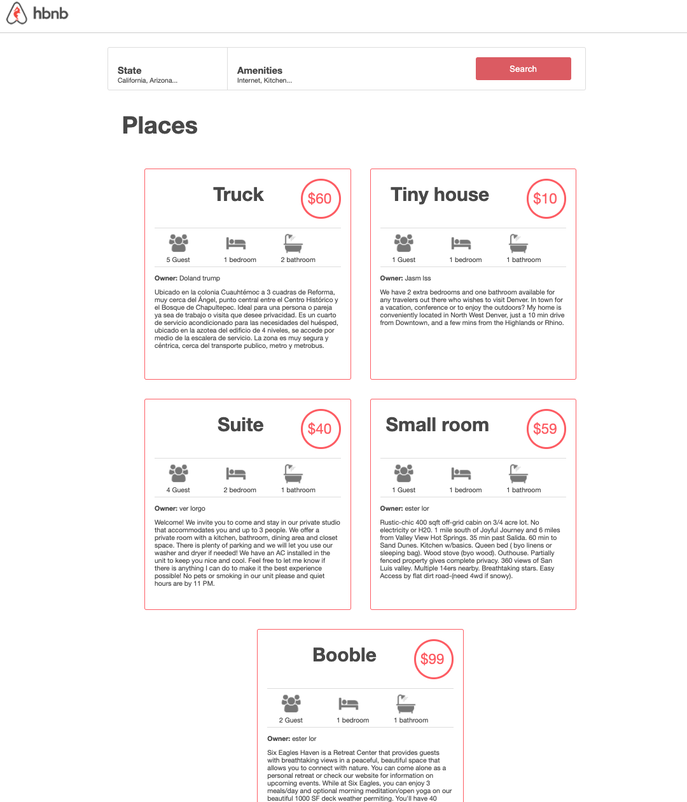
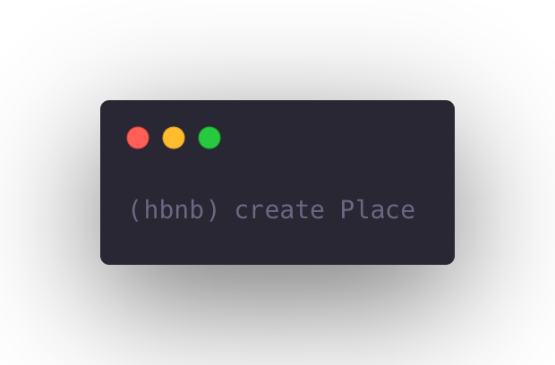
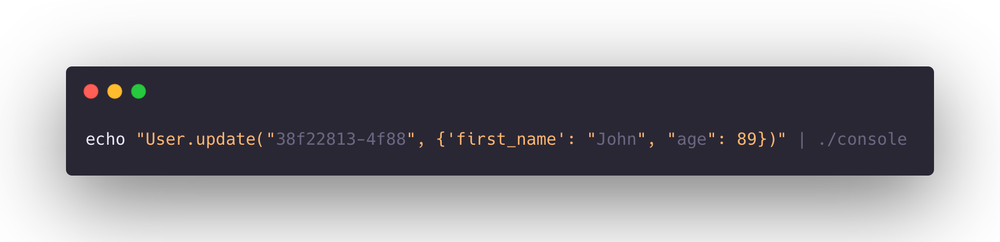

# Airbnb
The goal of the project is to deploy in the server a simple copy of the AirBnB website.
This repository contains the initial stage of a student project to build a clone of the AirBnB website. This stage implements a backend interface, or console, to manage program data. Console commands allow the user to create, update, and destroy objects, as well as manage file storage. Using a system of JSON serialization/deserialization, storage is persistent between sessions.



[](https://travis-ci.org/joemccann/dillinger)

## start

This is how the structure is:


The following instructions will allow you to obtain a copy of the local project for development and testing purposes


### Pre-requisite
To run the next project you need to have a `python version of 3.7`

## Installation
For the installation of this project follow the following steps:

Run the following command on your terminal.
```
git@github.com:daniela2001-png/AirBnB_clone.git
```
Then you have to move to the directory where the project is and executed
```
cd AirBnB_clone
```
```
./console
```
Examples of its use in interactive and non-interactive mode:





### Comands

The following commands will be executed and the result will be saved in the `file.json`

- UNIQUE CLASSES
-  - BaseModel
-  -  User
-  -  State
-  - City
-  - Amenity
-  - Place
-  - Review


| COMAND | SYNTAXIS | FUNCTION |
| ------ | ------ | ----- |
| create |  **create <class name>** |  Creates a new instance of class, saves it (to the JSON file) and prints the id |
| show | **update <class name> <id>** or **<class name>.show(<id>)** | Prints the string representation of an instance based on the class name and id |
| destroy | **update <class name> <id>** or **<class name>.destroy(<id>)** | Deletes an instance based on the class name and id |
| all | **all <class name>**  or **all** or **<class name>.all()** | Prints all string representation of all instances based or not on the class name. |
| update | **update <class name> <id> <attribute name> "<attribute value>"**     or   **<class name>.update(<id>, <attribute name>, <attribute value>)** or **<class name>.update(<id>, <dictionary representation>)**| Updates an instance based on the class name and id by adding or updating attribute (save the change into the JSON file). |
|count|**<class name>.count()** |  retrieve the number of instances of a class |


Running the tests ⚙️
------------------------------
To run tests on this project and look at its behavior is equal to a console to execute a save a classes based in python
```
python3 -m unittest discover tests
```
All the tests are in the test folder, if you have any suggestions, make a pull request

authors ✒️
Daniela - [GitHub](https://github.com/daniela2001-png) Andres reyes - [Web page](http://andresredev.co/)
Juan Rengifo - [GitHub](https://github.com/juankarlos999)


acknowledgements
-------------------------------------------
the next plan is reached thanks to the guide of holberton and starkoverflow
